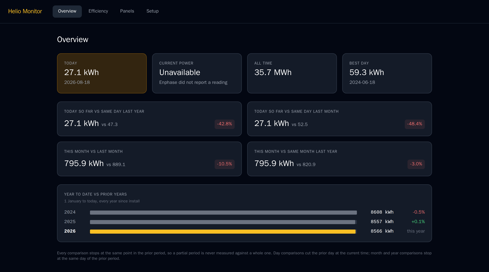

# ☀️ Helio Monitor

**The solar dashboard Enphase never built.**

Helio Monitor connects to your Enphase system and gives you the historical comparisons and efficiency tracking that the Enlighten app is missing — like knowing whether today's production beats the same day last year, whether your panels are degrading faster than the warranty allows, and which panel might be underperforming.



---

## What It Does

- **Historical comparisons** — Today vs. same day last year, this month vs. same month last year, YTD vs. prior year
- **Efficiency tracking** — Performance Ratio trend since install, weather-normalized
- **Degradation alerts** — Flags when annual degradation exceeds your warranty threshold
- **Panel heatmap** — Spot underperforming microinverters at a glance
- **Owns your data** — Everything stored locally in PostgreSQL, no third-party cloud

---

## Deploy in One Click

### DigitalOcean (Recommended)

[](https://cloud.digitalocean.com/apps/new?repo=https://github.com/YOUR_USERNAME/helio-monitor)

> 🎁 New to DigitalOcean? Use the referral link below for **$200 free credit** — enough to run Helio Monitor for months.
>
> **[→ Get $200 free credit on DigitalOcean](https://m.do.co/c/YOUR_REFERRAL_CODE)**

Full guide: [docs/deploy/digitalocean.md](docs/deploy/digitalocean.md)

### Railway

[](https://railway.app/new/template?template=https://github.com/YOUR_USERNAME/helio-monitor)

> 🎁 New to Railway? Sign up with this link and get **$5 free credit**.
>
> **[→ Sign up on Railway](https://railway.app?referralCode=YOUR_CODE)**

Full guide: [docs/deploy/railway.md](docs/deploy/railway.md)

### Self-Host (Raspberry Pi / Home Server)

Prefer to keep everything local? Full guide: [docs/deploy/raspberry-pi.md](docs/deploy/raspberry-pi.md)

### Manual Docker Install

```bash
git clone https://github.com/YOUR_USERNAME/helio-monitor
cd helio-monitor
cp .env.example .env
# Edit .env with your Enphase credentials
make up
make migrate
make backfill
```

Full guide: [docs/INSTALL.md](docs/INSTALL.md)

---

## Prerequisites

- An Enphase solar system with an Enlighten account
- A free Enphase developer account at [developer-v4.enphase.com](https://developer-v4.enphase.com)
- Your Enphase API key and System ID

---

## ☕ Support This Project

Helio Monitor is free and open source. If it saves you money by catching a degrading panel early — or just makes your mornings a little more satisfying — consider buying me a coffee.

[](https://www.buymeacoffee.com/YOUR_USERNAME)

---

## Tech Stack

- **Backend:** Python 3.11, FastAPI, SQLAlchemy 2, APScheduler
- **Database:** PostgreSQL 15
- **Frontend:** React 18, Vite
- **Deployment:** Docker, Docker Compose

---

## Documentation

| Document | Description |
|----------|-------------|
| [docs/INSTALL.md](docs/INSTALL.md) | Full manual installation guide |
| [docs/deploy/digitalocean.md](docs/deploy/digitalocean.md) | DigitalOcean one-click deploy |
| [docs/deploy/railway.md](docs/deploy/railway.md) | Railway one-click deploy |
| [docs/deploy/raspberry-pi.md](docs/deploy/raspberry-pi.md) | Raspberry Pi / home server |
| [docs/CONFIGURATION.md](docs/CONFIGURATION.md) | All environment variables explained |
| [docs/CONTRIBUTING.md](docs/CONTRIBUTING.md) | How to contribute |

---

## License

MIT — do whatever you want with it.
