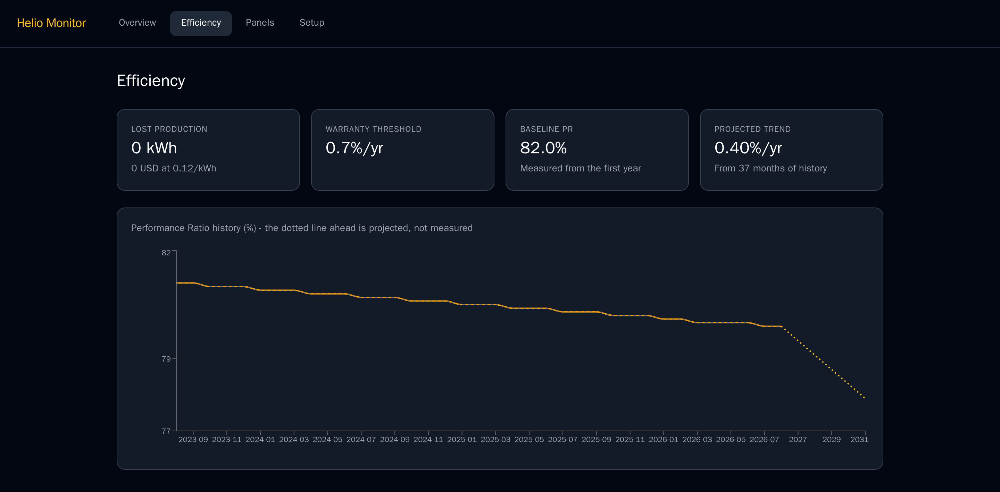
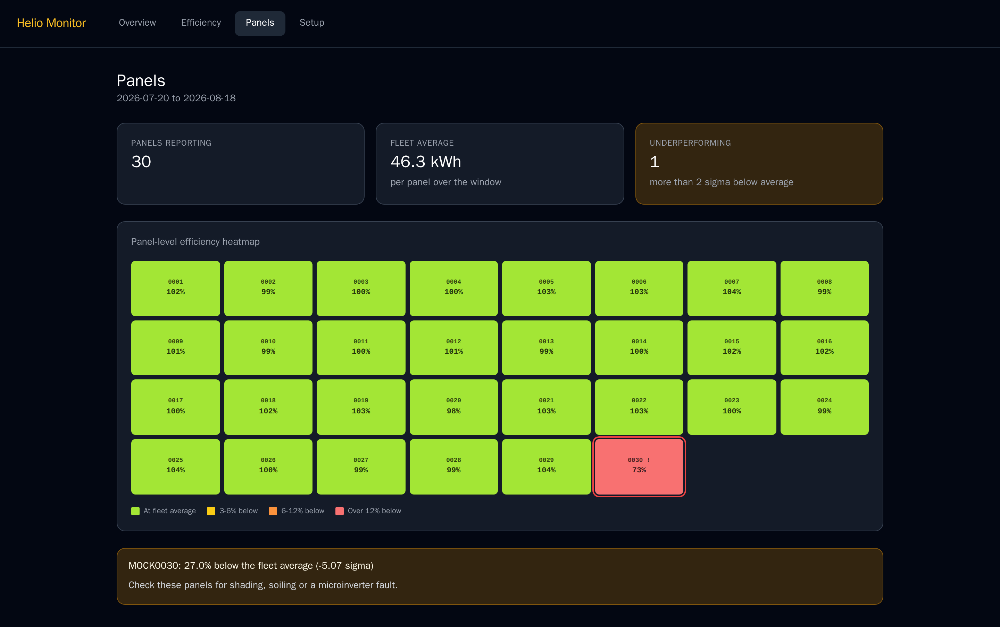

# ☀️ Helio Monitor

**The solar dashboard Enphase never built.**

Helio Monitor connects to your Enphase system and gives you the historical comparisons and efficiency tracking that the Enlighten app is missing — like knowing whether today's production beats the same day last year, whether your panels are degrading faster than the warranty allows, and which panel might be underperforming.


<sub>The Overview page on the synthetic dataset `make seed-mock` generates. Current power reads "Unavailable" there because it is the one figure that comes from a live Enphase call rather than from stored history.</sub>

---

## What It Does

- **Historical comparisons** — Today so far vs. the same point in the same day last year, this month vs. same month last year, YTD vs. prior year
- **Efficiency tracking** — Performance Ratio trend since install, weather-normalized
- **Degradation alerts** — Flags when annual degradation exceeds your warranty threshold
- **Panel heatmap** — Spot underperforming microinverters at a glance
- **Owns your data** — Everything stored locally in PostgreSQL, no third-party cloud

### Efficiency



Performance Ratio is the share of the energy available to the array that it actually delivered, so it separates a real decline from a cloudy month. The baseline it is judged against is the system's own first year, not a theoretical 100%, and the dotted line projects the measured trend forward so you can see it against your warranty before the warranty expires.

### Panels



Every microinverter reports its own production, so a single shaded, soiled or failing panel shows up as a cold cell instead of disappearing into the system total.

---

## Install

Helio Monitor runs on Docker Compose, on anything from a Raspberry Pi to a
cloud VM.

```bash
git clone https://github.com/stephaneminisini/Helio
cd Helio
make init          # copies .env.example to .env and generates FERNET_KEY
# Edit .env with your Enphase credentials
make up
make migrate
# Open http://localhost:3000, fill in the Setup tab, connect your Enphase account
make backfill
```

Full guide: [docs/INSTALL.md](docs/INSTALL.md). Keeping it on hardware you own?
[docs/deploy/raspberry-pi.md](docs/deploy/raspberry-pi.md) covers the Pi and
home-server case, including remote access over Tailscale.

---

## Prerequisites

- An Enphase solar system with an Enlighten account
- A free Enphase developer account at [developer-v4.enphase.com](https://developer-v4.enphase.com)
- Your Enphase API key and System ID

---

## ☕ Support This Project

Helio Monitor is free and open source. If it saves you money by catching a degrading panel early — or just makes your mornings a little more satisfying — consider buying me a coffee.

[](https://buymeacoffee.com/stephaneminisini)

---

## Tech Stack

- **Backend:** Python 3.13, FastAPI, SQLAlchemy 2, APScheduler
- **Database:** PostgreSQL 15
- **Frontend:** React 18, Vite
- **Deployment:** Docker, Docker Compose

---

## Documentation

| Document | Description |
|----------|-------------|
| [docs/INSTALL.md](docs/INSTALL.md) | Full manual installation guide |
| [docs/deploy/raspberry-pi.md](docs/deploy/raspberry-pi.md) | Raspberry Pi / home server |
| [docs/CONFIGURATION.md](docs/CONFIGURATION.md) | All environment variables explained |
| [docs/CONTRIBUTING.md](docs/CONTRIBUTING.md) | How to contribute |

---

## License

MIT. Use it, change it, sell it; just keep the copyright notice. See [LICENSE](LICENSE).
